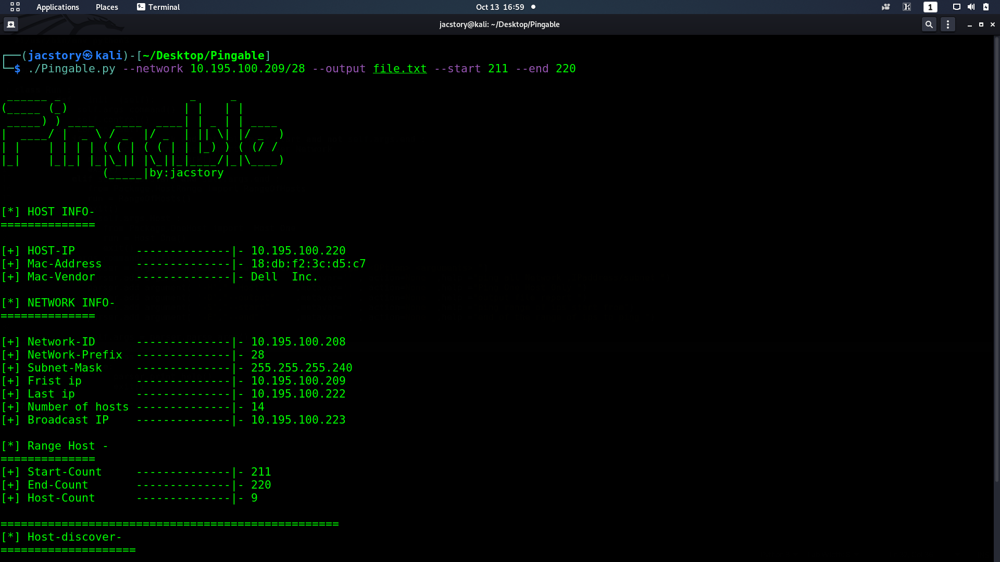
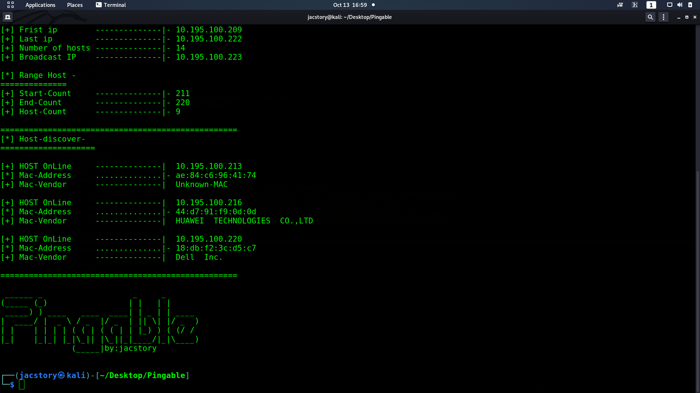
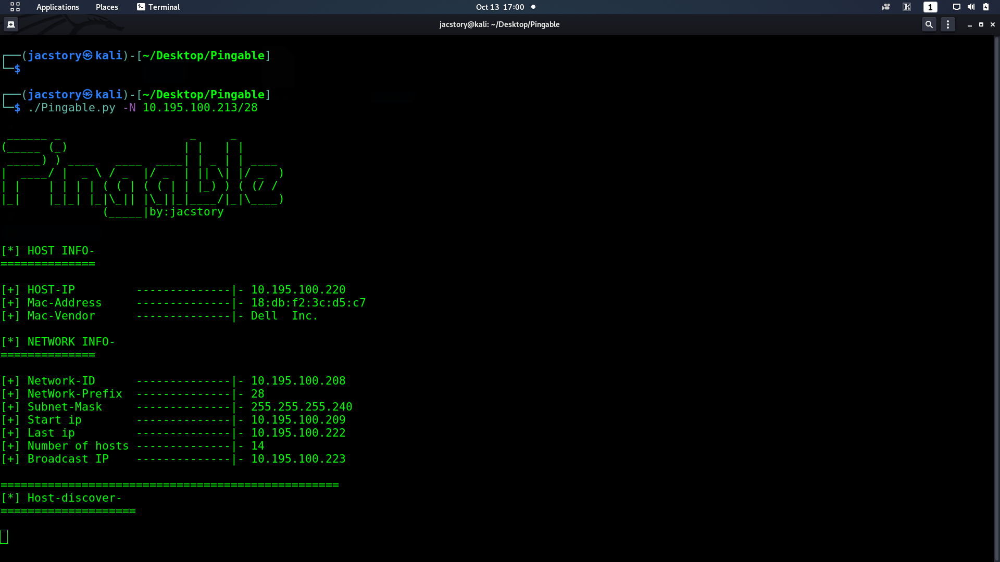
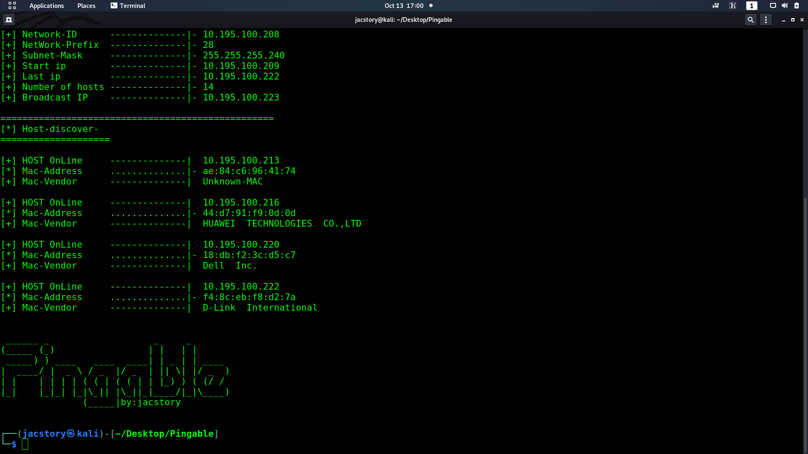
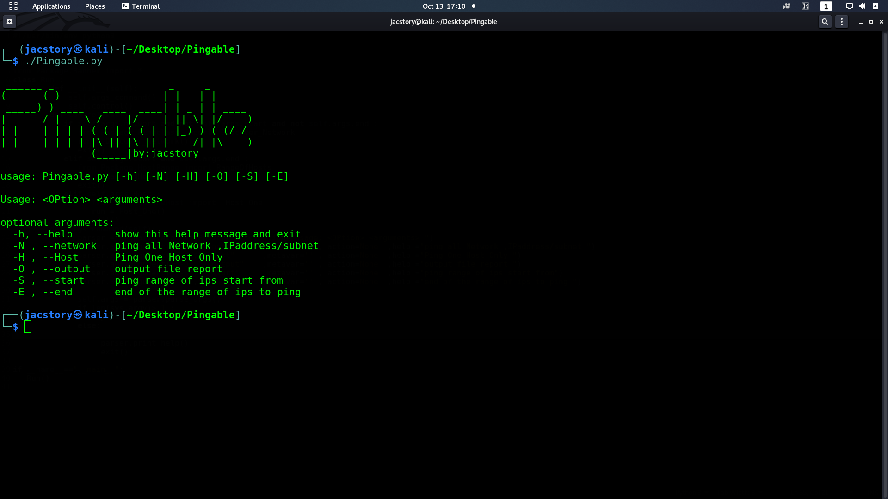

# Pingable
### - Pingable
- its tool help to discover the hosts in the network written by Python3
Pingable uses the ICMP protocol to ping the hosts on the same network or pingable network
if the firewall is set to drop the ICMP packet so you can not discover the host put still able to bing other hosts on the same network

## discover mac and the vendor -
     
 to can get full ideas about the network you should know the network devices  and the vendor about it
 Pingale use the Arp protocol to grep the mac address of devices over a network it read from file mac-vendor 
 mac-vendor file.txt have 43212 mac address to grep mac from the list after compiling the mac with 
 the mac device get from arp protocol   

 ### How to use
 * git clone https://www.github.com/jac11/Pingable.git
 * cd Pingable
 * chmod +x Pingable.py
 * to display help minue type ./Pingable -h
 ```
 ______ _                   _     _       
(_____ (_)                 | |   | |      
 _____) ) ____   ____  ____| | _ | | ____ 
|  ____/ |  _ \ / _  |/ _  | || \| |/ _  )
| |    | | | | ( ( | ( ( | | |_) ) ( (/ / 
|_|    |_|_| |_|\_|| |\_||_|____/|_|\____)
               (_____|by:jacstory                    

usage: Pingable.py [-h] [-N] [-H] [-O] [-S] [-E]

Usage: <OPtion> <arguments>

optional arguments:
  -h, --help       show this help message and exit
  -N , --network   ping all Network ,IPaddress/subnet
  -H , --Host      Ping One Host Only
  -O , --output    output file report
  -S , --start     start of the range Ips
  -E , --end       end of the range ips
```
* for ping all subnet use -N or --Network with subnet ./Pingable.py -N 192.168.1.22/24 use your LAN IP address with Subnet Mask
* to ping one Host Use -H or --Host ./Pingable -H 10.195.100.2/24 or 10.195.100.2
* to ping renge of ip form use ./Pingable.py -N192.168.1.34/24 -S 20 -E 100 -O report.txt
   -S start range of IP -E end range of IP -O to save the output into file
### noted :
 -  To use Pingable to discover a range of ips working with /24 to /32 so the maximum Number of Hosts is 254 host 
 ### Screenshot
   
  
  
### [for Connect]
* administrator@jacstory.tech
* thank you 

